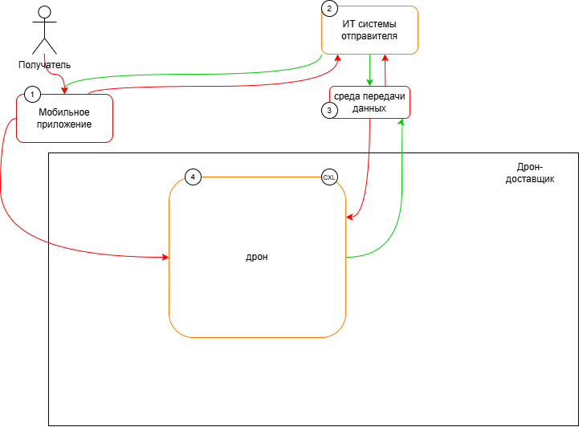
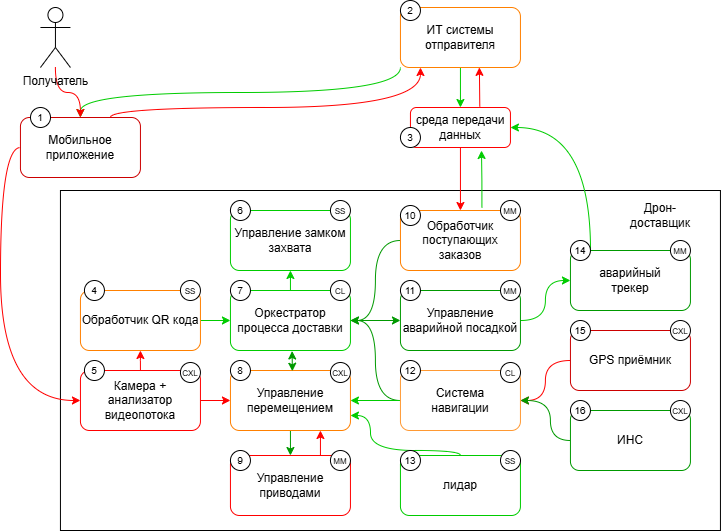
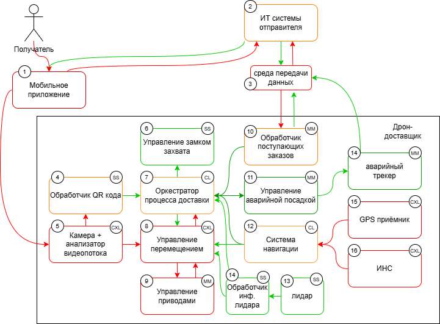

# Учебный пример "Автономный робот-доставщик"

## Краткое описание проектируемой системы

Продукт: дрон, который доставляет груз получателю-физическому лицу.

Бизнес-функция: дрон должен доставить заказ конечному адресату и вернуться на базу

## Ключевые ценности, ущербы, неприемлемые события
| Ценность | Ущербы и неприемлемые события | Критичность | Комментарий |
|----------|-------------------------------|-------------|-------------|
|Люди|в результате физического контакта причинён вред здоровью людей|Высокая||
|Инфраструктура и прочие материальные ценности|в результате физического контакта причинён материальный ущерб третьим лицам и организациям|Высокая||
|Заказ|Заказ не доставлен; похищен; повреждён|Средняя||
|Дрон|Угнан; сломан|Средняя||

## Контекст

# Политика архитектуры (монолитный вариант)

## Основные функциональные сценарии

## Высокоуровневая архитектура (декомпозиция монолитной части)

### Описание подсистем
|№| Название | Назначение |
|---|----------------|------------------------------------|
|1|Мобильное приложение|Мобильный клиент получателя заказа|
|2|ИТ системы отправителя|Система управления заказами отправителя|
||Среда передачи данных|Internet|
|3|Управление замком захвата|Контроллер замка, удерживающего заказ|
|4|Обработчик поступающих заказов|Обработчик пполучает информацию о доставляемом заказе|
|5|Оркестратор процесса доставки|Получает данные о заказе, чтобы сворфмировать маршрут и дать указания дрону|
|6|Камера + анализатор видеопотока|Камера для сканирования QR-кода и обнаружения препятствий|
|7|Управление перемещением|Определение маршрута и следование по нему|
|8|GPS приёмник|Получает данные из системы GPS для навигации|
|9|Управление приводами|Осуществляет контроль приводов для перемещения дрона|

## Расширенные диаграммы функциональных сценариев

## Цели и предположения безопасности
### Цели безопасности
1. Только аутентичные и авторизованные получатели получают заказ.
2. Для полёта используются только разрешённые для полётов районы и эшелоны.
3. ИТ система отправителя в любой ситуации имеет достоверную информацию о положении дрона.
### Предположения безопасности
1. ИТ системы отправителя защищены.
2. Мобильное приложение получателя нельзя считать доверенным.

### Таблица соотнесения ценностей, неприемлемых событий и целей безопасности
| Ценность | Ущербы и неприемлемые события | Критичность | Цель безопасности |
|----------|-------------------------------|-------------|-------------|
|Люди|в результате физического контакта причинён вред здоровью людей|Высокая|2, 3|
|Инфраструктура и прочие материальные ценности|в результате физического контакта причинён материальный ущерб третьим лицам и организациям|Высокая|2, 3|
|Заказ|Заказ не доставлен; похищен; повреждён|Средняя|1, 3|
|Дрон|Угнан; сломан|Средняя|2, 3|

## Негативные сценарии

## Политика архитектуры
### Дальнейшая декомпозиция высокоуровневой архитектуры

### Описание подсистем
|№| Название | Назначение |
|---|----------------|------------------------------------|
|1|Мобильное приложение|Мобильный клиент получателя заказа|
|2|ИТ системы отправителя|Система управления заказами отправителя|
|3|Среда передачи данных|Internet|
|4|Обработчик QR-кода|Обработчик QR-кода клиента для подтверждения получателем личности|
|5|Камера + анализатор видеопотока|Камера для сканирования QR-кода и обнаружения препятствий|
|6|Управление замком захвата|Контроллер замка, удерживающего заказ|
|7|Оркестратор процесса доставки|Получает данные о заказе, чтобы сворфмировать маршрут и дать указания дрону|
|8|Управление перемещением|Определение маршрута и следование по нему|
|9|Управление приводами|Осуществляет контроль приводов для перемещения дрона|
|10|Обработчик поступающих заказов|Обработчик пполучает информацию о доставляемом заказе|
|11|Управление аварийной посадкой|Система аварийной посадки, способная перехватить управление приводами|
|12|Система навигации|Система определения местоположения дрона|
|13|Лидар|Лазерный дальномер|
|14|Аварийный чекер|Детектор аварийной ситуации, передает в систему сообщение в случае активации аварийной посадки|
|15|GPS приёмник|Получает данные из системы GPS для навигации|
|16|ИНС|Инерциальная система навигации, использует гироскопы и акселерометры для навигации|

# Версия 1.01

# Версия 1.02

# Упражнения

## 1. Моделирование негативных сценариях
Опираясь на новую политику архитектуры, произведите моделирование негативных сценариев для других доменов в системе. Ответьте на следующие вопросы:
1. Какие ЦБ нарушаются, если в системе нет защиты?
2. Политика архитектуры предотвращает нарушение этих ЦБ?
3. Если нет, то как можно это исправить?

## 2. Новая политика архитектуры
В данный момент в системе большое количество довольно сложных компонентов, которые являются доверенными доменами, либо доменами повышающими целостность. Попробуйте упростить защиту системы, выполнив следующее:
1. Найдите в системе сложные компоненты, которые являются доверенными или повышающими целостность.
2. Попробуйте декомпозировать систему, разбив крупные домены на более простые.
3. Смоделируйте негативные сценарии для новых доменов, чтобы выявить нарушения ЦБ.
4. Обновите политику архитектуры так, чтобы ЦБ снова соблюдались.

## 3. Новые цели безопасности*
После обновления политики архитектуры компания исключила реализацию критических рисков, но всё еще несет убытки из-за не доставленных заказов. Попробуйте доработать цели безопасности таким образом, чтобы повысить вероятность доставки заказа. Обновите политику архитектуры соответственно. Возможно потребуется дополнительная декомпозиция или доработка системы.